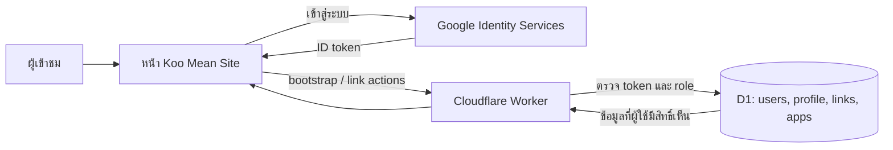

<div align="center">

# ◈ Koo Mean Site

### โปรไฟล์และ Link Hub ที่แสดงรายการตามสิทธิ์ของผู้ใช้


[ภาพรวม](#overview) · [ฟีเจอร์](#features) · [สิทธิ์](#roles) · [ติดตั้ง](#setup)

</div>

> Koo Mean Site เป็นหน้าโปรไฟล์และศูนย์รวมลิงก์/แอป ข้อมูลที่มี role จำกัดจะถูกกรองใน backend ก่อนส่งให้หน้าเว็บ

<a id="overview"></a>
## 🌟 ภาพรวม

หน้าเว็บคือ [`https://link.koomean.com/`](index%20koomeansite.html) เขียนด้วย HTML/CSS/JavaScript ในไฟล์เดียว ไม่ต้อง build ก่อนเผยแพร่ ใช้ Cloudflare Worker + D1 ตาม [`../CloudFlare/wrangler.portal.jsonc`](../CloudFlare/wrangler.portal.jsonc)



<a id="features"></a>
## ✨ ฟีเจอร์

| ฟีเจอร์ | รายละเอียด |
|---|---|
| **👤 โปรไฟล์** | แสดงชื่อ ข้อมูลแนะนำตัว และ media/profile fields จาก backend |
| **🖼️ รูปโปรไฟล์/พื้นหลัง** | แสดงรูป Blog/Site ที่ผู้ดูแลเปลี่ยนผ่าน Admin Dashboard และเก็บผ่าน D1 |
| **🔗 Link Hub** | รวมลิงก์และแอป พร้อมชื่อ ไอคอน กลุ่ม และสถานะปักหมุด |
| **🔎 ค้นหา** | กรองรายการลิงก์จากหน้าเว็บได้ทันที |
| **🔐 Google Sign-In** | ให้ผู้ใช้ล็อกอินเพื่อดูเนื้อหาตาม role และส่งคำขอลงทะเบียนเมื่อเป็นผู้ใช้ใหม่ |
| **🛡️ Role/group** | กำหนดการมองเห็นรายการด้วย `Group` ที่สัมพันธ์กับ role ของผู้ใช้ |
| **🔑 Access Code** | เปิดลิงก์ที่ตั้งรหัสผ่านได้ผ่านการตรวจสอบกับ backend |
| **⚙️ Admin tools** | ผู้ดูแลจัดการลิงก์และ role ของผู้ใช้ผ่าน action ที่ Worker อนุญาต |
| **📱 Responsive UI** | ปรับ layout สำหรับจอคอมพิวเตอร์และมือถือ พร้อมธีมมืด |

<a id="roles"></a>
## 🛡️ การมองเห็นและสิทธิ์

```text
ผู้ใช้ที่ยังไม่ล็อกอิน ──> รายการ public
ผู้ใช้ที่ล็อกอิน ───────> public + กลุ่มที่ role ตรงกัน
ผู้ใช้ role admin ──────> รายการทั้งหมดและเครื่องมือ admin ที่ได้รับอนุญาต
```

- `Group` ระบุ role ที่ดูรายการได้; backend รองรับหลาย role ตามตัวคั่นที่กำหนดในโค้ด
- Worker ตรวจ ID token และ role ฝั่ง server; การซ่อนเมนูใน frontend ไม่ได้เพิ่มสิทธิ์หรือป้องกัน API
- Access Code เป็นกลไกปลดล็อกตามการตั้งค่ารายการ ไม่ควรใช้แทน role สำหรับข้อมูลสำคัญ
- การเพิ่ม/เปลี่ยน role ต้องตรวจผลด้วยบัญชีทดสอบแต่ละระดับ

## 🗄️ ข้อมูลและการทำงาน

| ข้อมูล | D1 table | ใช้ทำอะไร |
|---|---|---|
| Profile | `profile` | ข้อมูลส่วนแนะนำตัวและเว็บไซต์ |
| รูปโปรไฟล์ | `site_profile_images` | รูปโปรไฟล์และภาพพื้นหลังของเว็บ |
| Links | `links` | URL, icon, Group, starred และ Access Code |
| Apps | `apps` | รายการแอปที่เกี่ยวข้อง |
| Users | `users` | บัญชีผู้ใช้และ role ซึ่ง backend ใช้ตรวจสิทธิ์ |

เมื่อเปิดหน้าเว็บ Site ขอ bootstrap จาก Worker; Worker ตรวจตัวตน (ถ้ามี) อ่านข้อมูลจาก D1 และส่งรายการที่ผ่านการกรองกลับมา การแก้ไขจาก admin ก็ส่งผ่าน Worker และตรวจสิทธิ์ใหม่ทุกคำขอ

<a id="setup"></a>
## 🚀 เริ่มต้นใช้งาน

### ☁️ Deploy backend

ตรวจ D1 binding `DB` และ `ALLOWED_ORIGINS` ใน `../CloudFlare/wrangler.portal.jsonc` แล้วจากโฟลเดอร์ `CloudFlare` รัน:

```bash
npx wrangler deploy --config wrangler.portal.jsonc
```

ถ้ามีการเปลี่ยน schema ให้ apply migration ที่จำเป็นก่อน deploy คู่มือย้ายข้อมูลอยู่ที่ [`../CloudFlare/MIGRATE-SHEETS-TO-D1.md`](../CloudFlare/MIGRATE-SHEETS-TO-D1.md)

### 🌐 เผยแพร่ frontend

1. อัปโหลด `index koomeansite.html` ไปยัง HTTPS static host
2. ตรวจค่า `API_URL` ให้ชี้ Worker ที่ deploy จริง
3. เพิ่ม origin ของ host ใน OAuth Client → **Authorized JavaScript origins**
4. เพิ่ม origin เดียวกันใน Worker `ALLOWED_ORIGINS`
5. ทดสอบหน้า public, login/register, role filtering, access code และการแก้ข้อมูลของ admin

ไม่จำเป็นต้องมี `portal.koomean.com` เพื่อให้ Site ทำงาน ให้ใช้โดเมนที่ host หน้า Koo Mean Site จริง

## 🧑‍💻 พัฒนาและความปลอดภัย

- UI อยู่ใน `index koomeansite.html`; API และ authorization อยู่ใน [`../CloudFlare/koomean-d1-worker.js`](../CloudFlare/koomean-d1-worker.js)
- HTML นี้ไม่มี build step; แก้ไฟล์แล้วเผยแพร่ static page ได้
- อย่าใส่ Apps Script URL เก่าหรือ credential ส่วนตัวกลับเข้า frontend
- OAuth Client ID เป็นค่าที่เผยแพร่บน browser ได้; client secret และ service-account key ต้องเก็บเป็นความลับและห้าม commit
- README นี้อธิบาย source/config ใน repository ไม่ได้รับรองสถานะ production deployment
